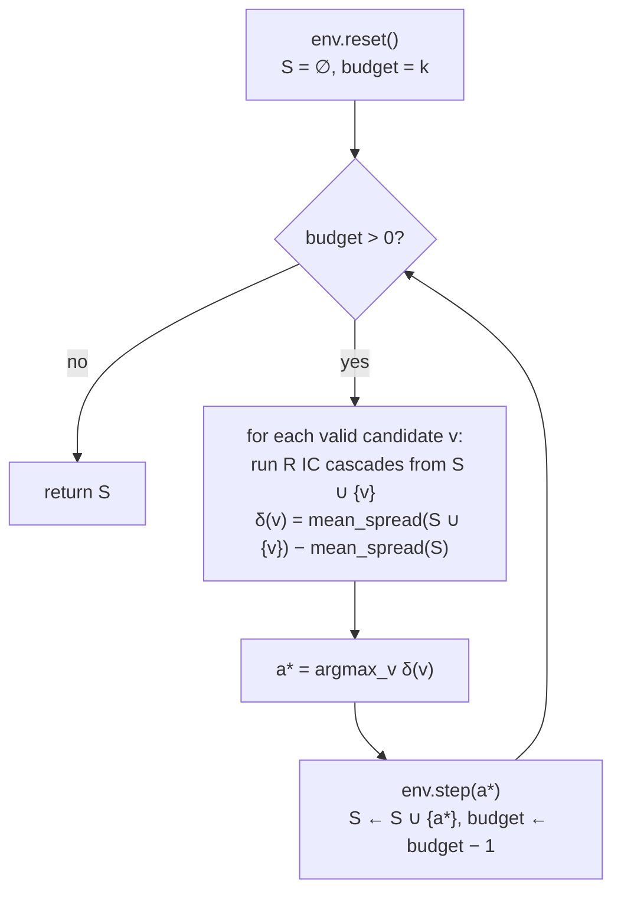
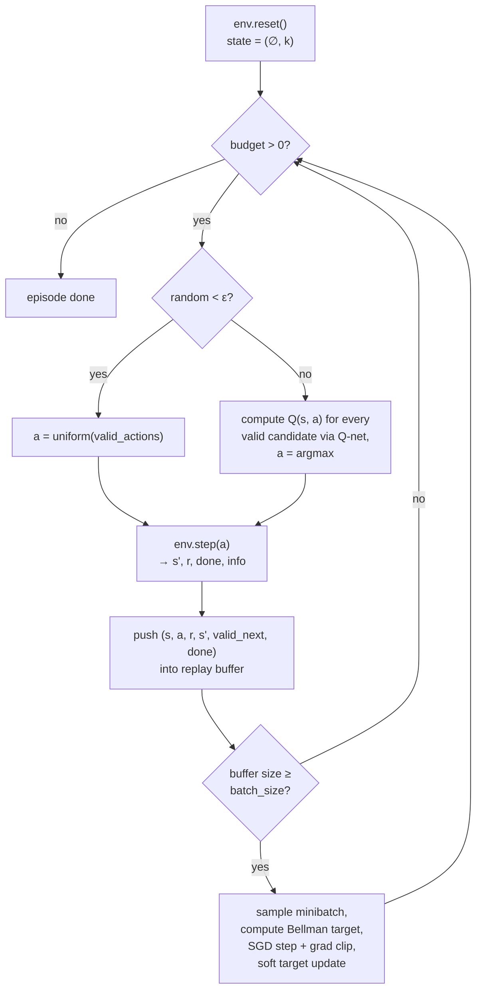
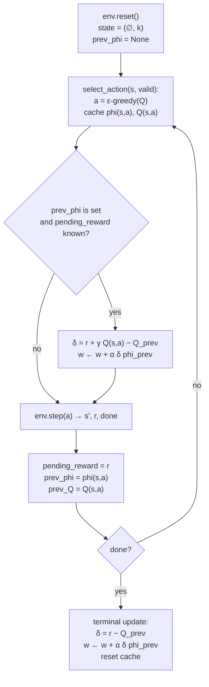
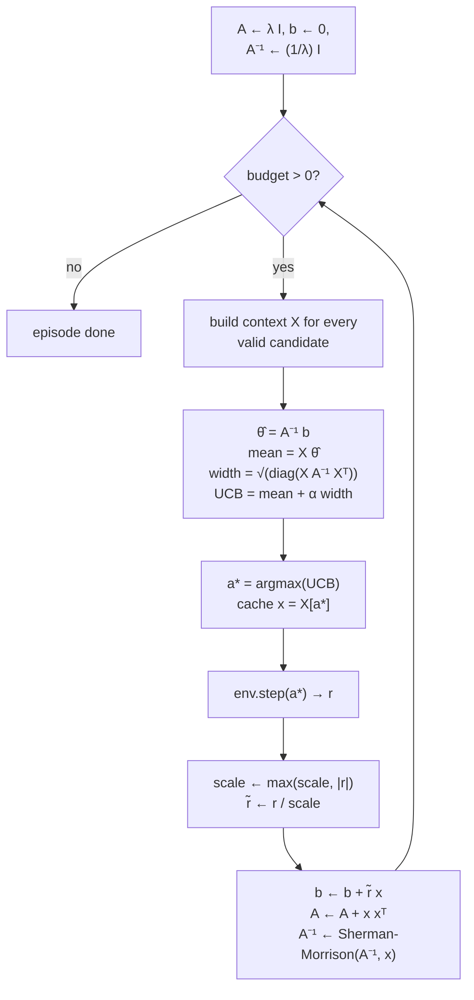

# RL Agents for Influence Maximization

Reference for all four planning/learning agents — **Greedy Monte Carlo** (the non-learning gold standard), **DQN**, **SARSA**, and **LinUCB**. All share the same `BaseAgent` interface and plug into the same `train_rl.py` runner.

---

## 1. Greedy Monte Carlo

`influence_max/agents/monte_carlo.py` → `GreedyMCAgent`

### What it is

Greedy MC is **not an RL agent** — it does not learn across episodes. Instead, it solves influence maximization directly as a planning problem using the classical **greedy submodular maximisation** algorithm (Kempe, Kleinberg, Tardos 2003):

> At each step, evaluate the _marginal influence gain_ of every valid candidate by running Monte Carlo IC simulations, and pick the candidate with the highest gain.

This is the **gold-standard accuracy baseline** for IM. By the submodularity of the influence function, the greedy algorithm is guaranteed to produce a seed set with spread ≥ (1 − 1/e) × OPT ≈ 63.2% of optimal.

### Algorithm

```
Inputs: graph G, IC model, budget k, rollouts R

S ← ∅
for i = 1 … k:
    for each candidate v ∉ S:
        δ(v) ← MC_spread(S ∪ {v}, R) − MC_spread(S, R)
    a*  ← argmax_v δ(v)
    S   ← S ∪ {a*}

return S
```

**MC_spread(S, R)** runs `R` Independent Cascade simulations from seed set `S` and returns the mean activated count. Each cascade follows the IC rule: node `u` activates each out-neighbour `v` independently with probability `P(u → v) = σ(H[u] · H[v])`.

### Complexity

| Phase                         | Cost                                       |
| ----------------------------- | ------------------------------------------ | ---------------- | ---------------- |
| Per step                      | `                                          | valid_candidates | × R` IC cascades |
| Full run (k=10, N=6301, R=50) | ~3.15 million cascades                     |
| Each cascade                  | BFS over graph where ~6,000 nodes activate |
| **Total**                     | **~618 seconds on a single CPU**           |

This is why the algorithm is called "expensive" — it is asymptotically `O(k · N · R · cascade_cost)`.

### Influence probability model

The link between GNNs and the IC model:

```
H[v] ∈ ℝ^128   ← learned by GraphSAGE + GAE (train_gnn.py)

P(u → v) = σ( H[u] · H[v] )   ← sigmoid of embedding dot-product
```

This is **the same probability model used by all agents in this project** — centrality heuristics, IMM, DQN, SARSA, LinUCB, and S2V-DQN all evaluate against `P(u → v) = σ(H[u] · H[v])`. The probability is pre-cached in `ICDiffusion.edge_probs` at startup.

### Per-episode loop (GreedyMC)



No learning, no model update. `select_action` is pure planning. `update()` is a no-op.

### Empirical result (budget=10, mc_sims=100, mc_rollouts=50, seed=42)

Run: `results/20260417_033949_greedy_mc.json`

**Final spread: 4430.05 / 6301 nodes (~70.3% of the network)**

| Step | Seed added | Marginal gain | Cumulative spread | Spread std |
| ---- | ---------- | ------------: | ----------------: | ---------: |
| 0    | **5410**   |      +4385.73 |           4385.73 |     ±66.59 |
| 1    | 1207       |         +1.73 |           4387.46 |     ±59.57 |
| 2    | 636        |         +8.94 |           4396.40 |     ±63.68 |
| 3    | 1857       |         +3.19 |           4399.59 |     ±61.36 |
| 4    | 2835       |         −1.88 |           4397.71 |     ±61.94 |
| 5    | 994        |        +15.58 |           4413.29 |     ±63.52 |
| 6    | 194        |         −9.48 |           4403.81 |     ±64.95 |
| 7    | 1649       |        +16.51 |           4420.32 |     ±62.30 |
| 8    | 1462       |         +1.37 |           4421.69 |     ±58.03 |
| 9    | 516        |         +8.36 |           4430.05 |     ±62.66 |

**Wall time: 617.87 s** (single episode)

**Key observations from the trace:**

- **Step 0 dominates** — node 5410 alone activates 4385.73 nodes. This is the single most important decision; it accounts for ~99 % of the total spread. This "hub saturation" behaviour is characteristic of scale-free / P2P networks where one central node can flood the graph.
- **Steps 4 and 6 show negative marginal gain** (−1.88, −9.48) relative to the previous MC estimate. This is Monte Carlo noise — the true marginal gain is non-negative by submodularity, but with R=50 rollouts each estimate has `std ≈ 60`, so negative deltas appear. With more rollouts (R=200) these would be ≥ 0 almost always.
- **The spread saturates quickly** — from step 1 onward, only ~44 additional nodes are added across 9 more seeds. The marginal returns are minimal because the first hub already activates ~95% of the reachable graph.
- **Final seed set**: `[194, 516, 636, 994, 1207, 1462, 1649, 1857, 2835, 5410]` — heterogeneous; many are not in the top-10 by degree, showing that greedy MC discovers combinations, not just individual hubs.

### Why this is the reference for all other agents

```
GreedyMC spread  = 4430.05   (gold standard)
DQN spread       = 4416.77   (−0.30 % vs GreedyMC)
SARSA spread     = 4393.43   (−0.83 %)
LinUCB spread    = 2233.22   (−49.6 % — fails)
IMM spread       = 4449.18   (+0.43 % — beats it)
```

Every learning agent is implicitly measured against this number. A learning agent that matches GreedyMC after training has justified its additional training cost. IMM can exceed it by sampling more reverse paths.

### CLI usage

```bash
python train_rl.py \
  --agent greedy_mc \
  --budget 10 \
  --mc-sims 100 \
  --agent-mc-rollouts 50 \
  --seed 42
```

| Flag                             | Used   | Meaning                                       |
| -------------------------------- | ------ | --------------------------------------------- |
| `--budget`                       | yes    | k seeds per episode                           |
| `--mc-sims`                      | yes    | rollouts for env reward (not agent selection) |
| `--agent-mc-rollouts`            | yes    | rollouts per candidate per step               |
| `--lr`, `--gamma`, `--epsilon-*` | **no** | ignored (no learning)                         |

---

## Common building blocks (learning agents)

All three agents read pre-trained GNN embeddings `H ∈ ℝ^{N × D}` from `node_embeddings.pt` (`N = 6,301`, `D = 128`).

### Shared state representation

The RL state is `S_t = (seed_set, budget_remaining)`. The seed set is a _frozenset_ (unordered, variable size), so we need an order-invariant aggregation before feeding it to a neural net or linear model. We use:

- `seed_mean = mean(H[seed_set])` → `(D,)` — captures the "centroid" of seeds
- `seed_max  = max(H[seed_set])` → `(D,)` — captures extreme features (DQN only)
- `budget_norm = budget / budget_max` → scalar in `[0, 1]`

For an empty seed set both pooled vectors are zero.

### Shared action representation

A candidate node `a` is represented by its embedding `H[a] ∈ ℝ^D`. Some agents add **interaction features** (Hadamard product `seed_mean ⊙ H[a]`), which let the model learn "is candidate `a` similar to / different from the existing seeds?".

### Reward signal (from the environment)

```
r_t = E[σ(seed_set ∪ {a_t})] − E[σ(seed_set)]
```

Marginal influence gain estimated by `MonteCarloEstimator` running `mc-sims` IC cascades. Reward magnitudes range from ~+4400 (first hub seed) down to ±20 (later seeds).

---

## 2. DQN — Deep Q-Network (off-policy Q-learning)

`influence_max/agents/dqn.py`

### Q-function

Action-conditional MLP — outputs a single scalar Q-value per `(s, a)` pair, evaluated independently for each candidate:

```
Q(s, a) = MLP_θ([ seed_mean ‖ seed_max ‖ budget_norm ‖ H[a] ])

MLP architecture:  Linear(state_dim + action_dim → 256) → ReLU
                 → Linear(256 → 256)                    → ReLU
                 → Linear(256 → 1)
```

`state_dim = 2D + 1 = 257`, `action_dim = D = 128`. Total input width = 385.

**Why action-conditional and not a 6,301-way output head?** The action space is huge (one node per output) and most actions are invalid at any step. An action-conditional Q-net evaluates `Q(s, a_i)` only for valid candidates `a_i`, generalises across nodes via the embedding, and trains far more parameter-efficiently.

### Loss & target

Standard DQN Bellman target with Huber loss:

```
ŷ = r + γ · max_{a′ ∈ valid(s′)} Q_target(s′, a′)        (for non-terminal s′)
ŷ = r                                                    (terminal)

L(θ) = SmoothL1( Q_θ(s, a),  ŷ )                          (Huber)
```

### Target network — soft Polyak updates

```
θ_target ← (1 − τ) · θ_target + τ · θ        every `target_update_freq` steps,  τ = 0.05
```

### Replay buffer

A `deque` of `_ReplayItem(state_feat, action_emb, reward, next_state_feat, next_valid_embs, done)`. The crucial bit is **`next_valid_embs`** — we cache the embedding rows for _all valid candidates_ at `s′` so that the Bellman max during training operates only over legal actions (excluding both seeds and activated nodes).

### Exploration — ε-greedy with exponential decay

```
ε(t) = ε_end + (ε_start − ε_end) · exp(−3 · min(1, t / epsilon_decay))
```

with defaults `ε_start = 1.0`, `ε_end = 0.05`, `epsilon_decay = 500` agent steps.

### Per-episode loop (DQN)



### Hyperparameters (CLI flags)

| Flag                                | Default            | Meaning                  |
| ----------------------------------- | ------------------ | ------------------------ |
| `--lr`                              | `1e-3`             | Adam learning rate       |
| `--gamma`                           | `0.99`             | Discount factor          |
| `--epsilon-start / --end / --decay` | `1.0 / 0.05 / 500` | Exploration schedule     |
| `--replay-buffer-size`              | `10_000`           | Max transitions stored   |
| `--batch-size`                      | `64`               | Minibatch SGD            |
| `--target-update-freq`              | `10`               | Soft target sync cadence |

---

## 3. SARSA — On-policy TD(0) with linear function approximation

`influence_max/agents/sarsa.py`

### Linear Q-function

```
Q(s, a) = w · φ(s, a)
```

where `w ∈ ℝ^{F}` is a single weight vector and `φ(s, a)` is a fixed feature map:

```
φ(s, a) = [ seed_mean,                  # (D,)  state aggregate
            H[a],                        # (D,)  candidate embedding
            seed_mean ⊙ H[a],            # (D,)  Hadamard interaction (state × action)
            budget_norm,                 # scalar
            1.0 ]                        # bias
```

`F = 3D + 2 = 386` for `D = 128`.

The Hadamard product is the "trick" that lets a _linear_ model express interactions like _"this candidate is dissimilar to my current seed set, so it probably covers new ground"_.

### TD(0) update — on-policy

```
δ_t = r_{t+1} + γ · Q(s_{t+1}, a_{t+1}) − Q(s_t, a_t)        (TD error)
w   ← w + α · δ_t · φ(s_t, a_t)
```

The crucial difference from DQN: `a_{t+1}` is the action _the policy actually takes next_ under ε-greedy, not `argmax_{a'} Q(s_{t+1}, a')`. SARSA is therefore **on-policy** — it accounts for the noise in its own exploration and tends to learn safer / more conservative strategies.

### How the on-policy update is sequenced in code

The target needs `(s', a')`, but `a'` isn't known until the _next_ `select_action()` call. So:

1. `select_action(s, valid)` chooses `a` and **caches** `(φ(s, a), Q(s, a))`.
2. `env.step(a)` returns reward `r`.
3. `update(transition)` stashes `r` as `_pending_reward` (no gradient yet).
4. Next `select_action(s', valid')` picks `a'`. Now we have everything: it computes `δ = r + γ Q(s', a') − Q(s, a)` and updates `w` against the **previously cached** features.
5. **Terminal step**: `update(transition)` sees `done=True` and immediately applies `δ = r − Q(s, a)` (no bootstrap), then resets the cache.

### Per-episode loop (SARSA)



### Per-step compute

A vectorised numpy matmul over all valid candidates:

```python
Φ ← stack φ(s, a) for a ∈ valid       # (n_valid, F)
Q ← Φ @ w                              # (n_valid,)
a* ← argmax(Q)
```

Single SGD step per `select_action` call. No replay buffer, no target network. Faster than DQN per-step, but learns more slowly per gradient.

### Hyperparameters (same shared flags)

`--lr`, `--gamma`, `--epsilon-*`. No DQN-specific flags apply.

---

## 4. LinUCB — Linear contextual bandit (Li et al. 2010)

`influence_max/agents/bandit.py`

### Bandit reformulation — why?

LinUCB **discards the sequential / Markov structure** entirely. Each seed selection is treated as an independent contextual bandit decision:

| Concept | Bandit equivalent                                     |
| ------- | ----------------------------------------------------- |
| Arm     | Candidate node `a`                                    |
| Context | Feature vector `x_a` built from current state         |
| Reward  | Marginal influence gain after picking `a`             |
| Goal    | Maximise _cumulative_ reward (no discount, no future) |

This is intentionally simpler than DQN/SARSA. It serves as an instructive contrast — showing what is _lost_ when you ignore long-horizon planning.

### Feature map

```
x(s, a) = [ H[a],                    # (D,)  candidate embedding
            seed_mean ⊙ H[a],        # (D,)  state-action interaction
            budget_norm,              # scalar
            1.0 ]                     # bias                              → (2D+2,) = 258

x ← x / ‖x‖₂                                  # row-normalised so ‖x‖ ≤ 1
```

L2 normalisation is _required_ for LinUCB's regret bound to hold; we also L2-normalise embedding rows on load for the same reason.

### Closed-form linear regression with confidence bounds

Maintain across all selections:

```
A     ∈ ℝ^{F×F}   ← λ · I            (regularised Gram matrix)
b     ∈ ℝ^{F}     ← 0                (response vector)
A⁻¹   ∈ ℝ^{F×F}   ← (1/λ) · I        (cached inverse)
```

For each candidate arm `a` with context `x_a`:

```
θ̂      = A⁻¹ b                                         (ridge regression estimate)
mean_a = θ̂ · x_a                                       (predicted reward)
width_a = sqrt( x_a · A⁻¹ · x_a )                      (uncertainty)
UCB_a  = mean_a + α · width_a                          (optimism in face of uncertainty)
```

Pick `a* = argmax_a UCB_a`. The `α · width` term provides automatic exploration — no ε schedule needed.

### Update — Sherman-Morrison rank-1 inverse update

After observing reward `r` (adaptively scaled to `[-1, 1]`):

```
b   ← b + r · x_a*

A⁻¹ ← A⁻¹ − (A⁻¹ x_a* x_a*ᵀ A⁻¹) / (1 + x_a*ᵀ A⁻¹ x_a*)
```

This avoids ever computing a 258×258 matrix inverse from scratch. Exact and `O(F²)` per update.

### Adaptive reward scaling

GAE rewards reach ~4,400 — naïve LinUCB would have `b` and `θ̂` blow up numerically. We track `_reward_scale = max(|r| seen)` and divide `r` before update so the signal stays in `[-1, 1]`. A single global scalar; trivially undone if needed.

### Per-episode loop (LinUCB)



### Hyperparameters (CLI flags)

| Flag              | Default | Meaning                                                 |
| ----------------- | ------- | ------------------------------------------------------- |
| `--linucb-alpha`  | `1.0`   | UCB exploration coefficient (higher → more exploration) |
| `--linucb-lambda` | `1.0`   | Ridge regularisation strength                           |

`--lr / --gamma / --epsilon-*` are unused.

### Cumulative learning across episodes

Unlike SARSA/DQN, the bandit's `(A, b)` state **persists across episodes**. So 50 episodes × 10 budget = 500 contextual bandit decisions, all contributing to one regression. Even a single episode produces meaningful results.

---

## Comparison cheatsheet

| Aspect                       | GreedyMC                        | DQN                              | SARSA                              | LinUCB                              |
| ---------------------------- | ------------------------------- | -------------------------------- | ---------------------------------- | ----------------------------------- |
| Bellman target               | n/a (planning)                  | `r + γ max_a' Q_target(s', a')`  | `r + γ Q(s', a')` (a' from policy) | `r` only — myopic                   |
| Models long-horizon planning | yes (full lookahead)            | yes                              | yes (slightly conservative)        | no                                  |
| Function approximation       | none — exact MC                 | 3-layer MLP (~300K params)       | linear (`F` params, F=386)         | linear closed-form (`F`+`F²` state) |
| Update rule                  | none                            | minibatch SGD, Huber loss        | single online TD gradient          | Sherman-Morrison rank-1             |
| Replay buffer                | no                              | yes                              | no                                 | no                                  |
| Target network               | no                              | yes (soft Polyak)                | no                                 | no                                  |
| Exploration                  | exhaustive (all candidates)     | ε-greedy w/ decay                | ε-greedy w/ decay                  | UCB (parameter-free decay)          |
| Per-step cost                | very heaviest (N×R cascades)    | heaviest (MLP forward)           | medium                             | lightest                            |
| Cross-episode learning       | none                            | weights persist                  | weights persist                    | `A`, `b` persist                    |
| Empirical spread (k=10)      | **4430.05**                     | 4416.77                          | 4393.43                            | 2233.22                             |
| Best when                    | small graphs, accuracy required | many episodes, complex landscape | interpretable weight vector needed | strong, low-variance baseline fast  |
